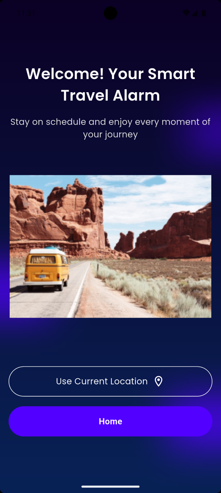
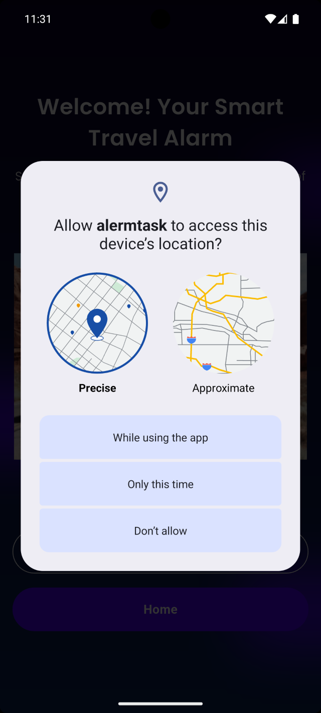
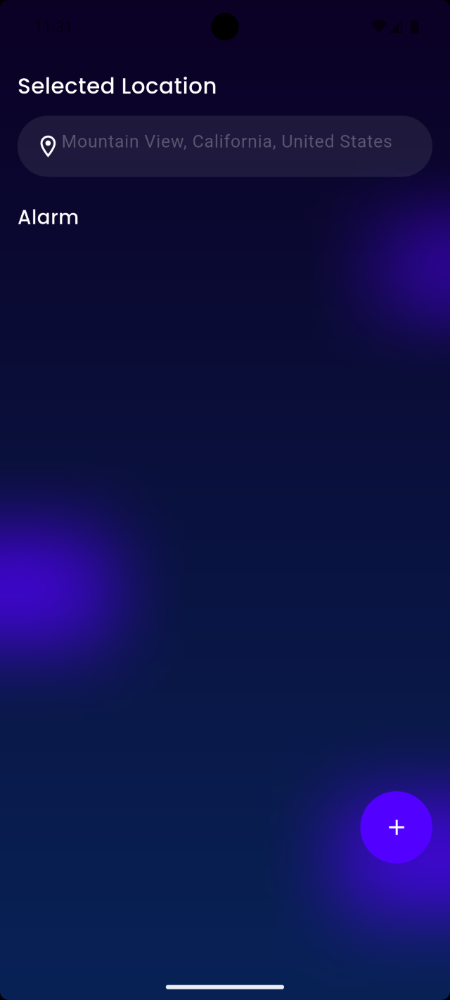
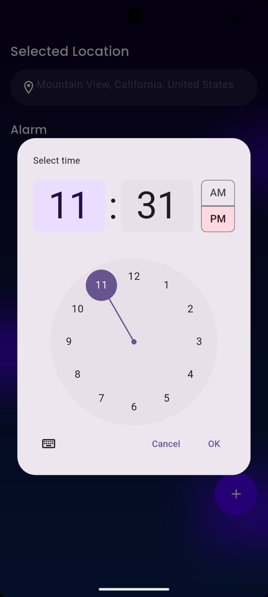
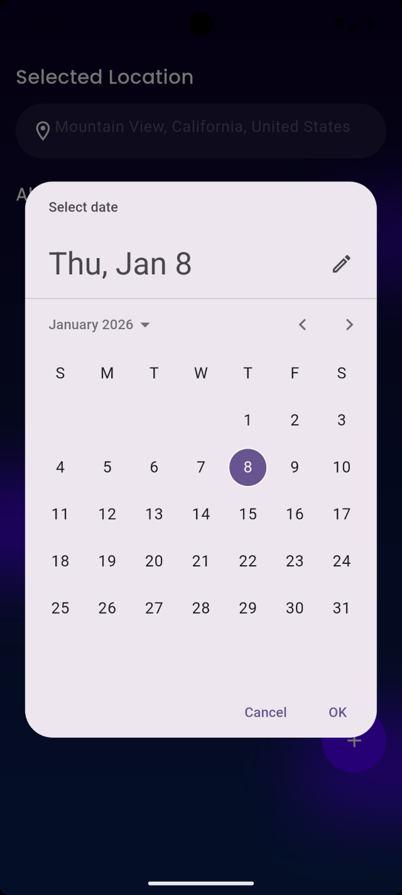
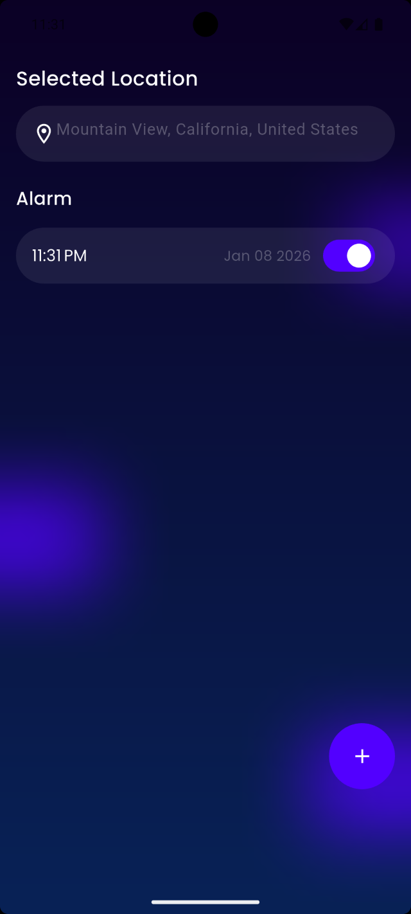
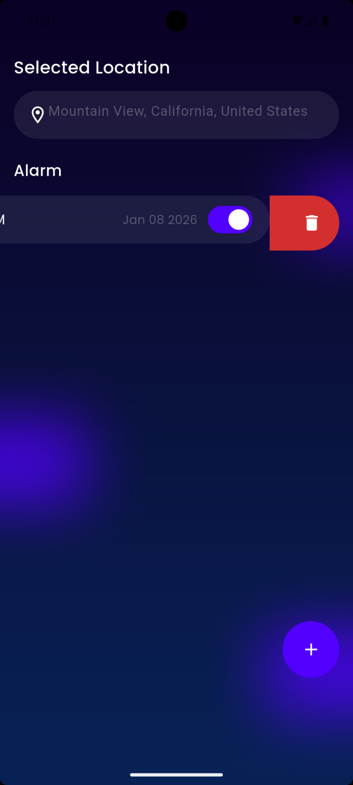

# Alarm App Flutter
A simple alarm app.

## Packages
  - smooth_page_indicator
  - shared_preferences
  - google_fonts
  - geolocator
  - flutter_bloc
  - equatable
  - intl
  - geocoding
  - flutter_local_notifications
  - timezone
## Look into the app
### Onboarding Screen

  
  
  

### Welcome Screen

  
  

### Alarm Screen

  
  
  
  
  
  

